# chatGPT
## Q1
Q1: What is Google Gemini?

A1:

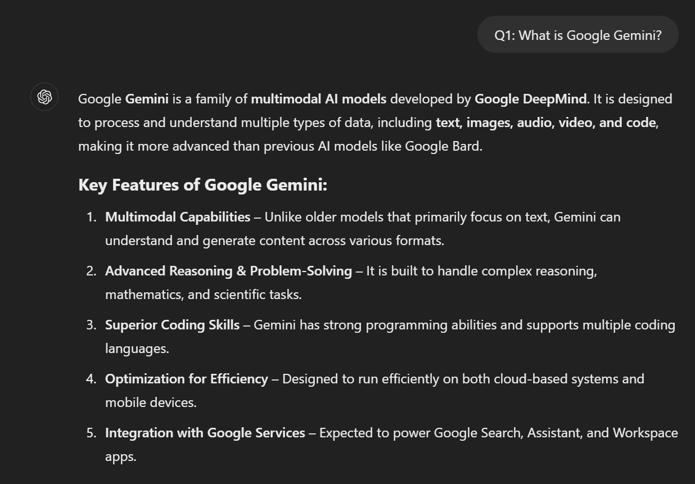

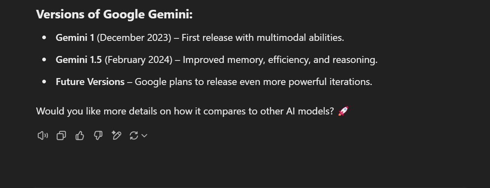

## Q2
Q2: What is chatGPT?

A2:

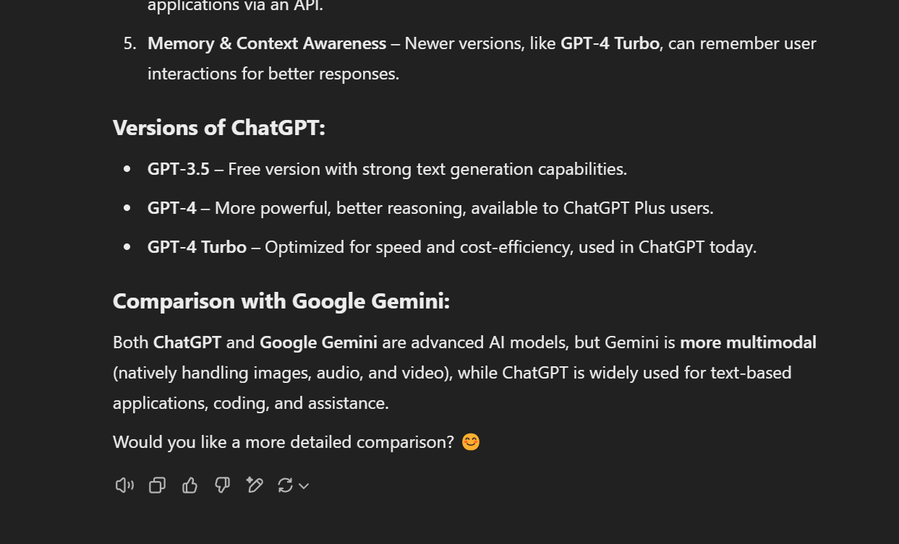

## Q3
Q3: What is CoPilot?

A3:

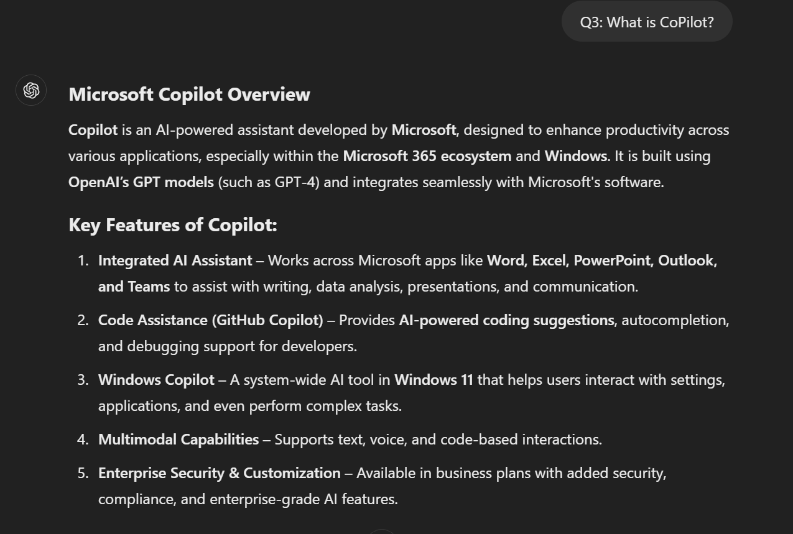

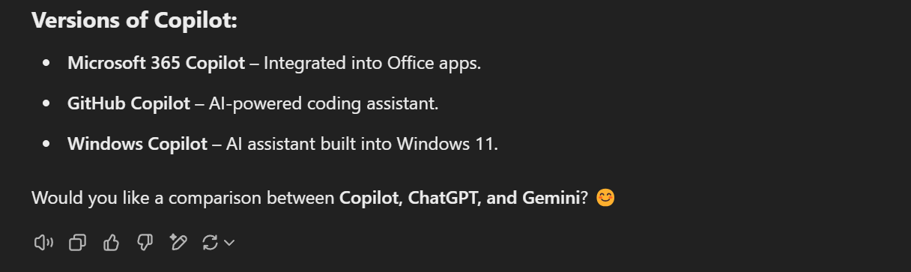

## Q4
Q4: What is Lumenova AI model?

A4:

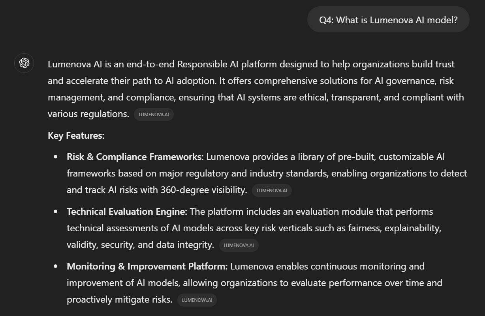

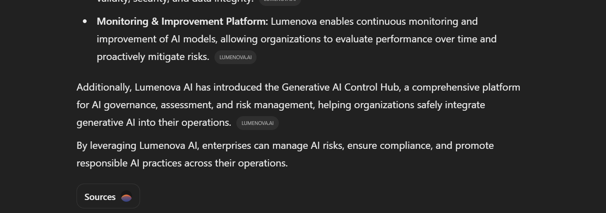

## Q5
Q5: What is DeepSeek-R1?

A5:

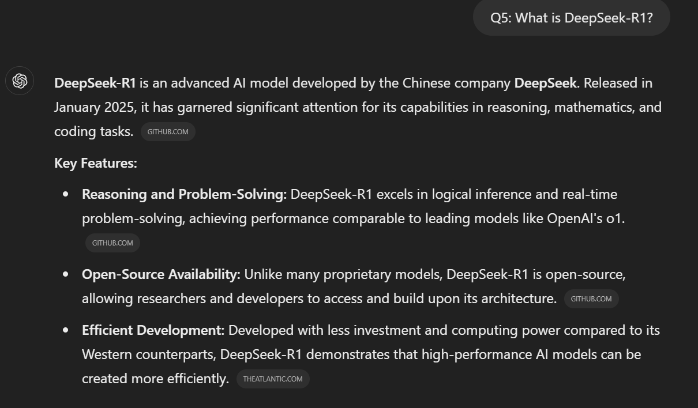

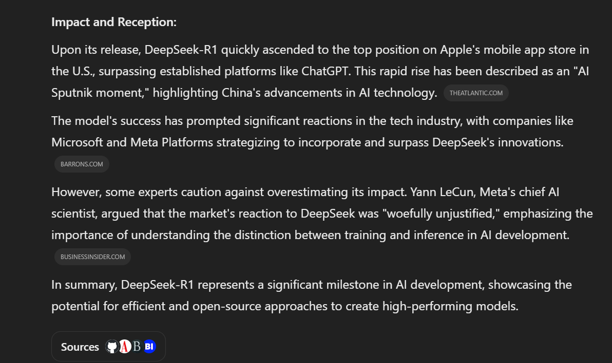

## Q6
Q6: 

Please compare these latest version of AI models -- 

+ latest version of Google Gemini AI model developed by Google company
+ latest version of chatGPT AI model developed by OpenAI company
+ latest version of CoPilot AI model developed by Microsoft
+ latest version of DeepSeek-RI AI model developed by DeepSeek company
+ latest version of Lumina-T2I AI model developed by Lumina AI company
+ latest version of Lumenova AI model developed by LinkedIn company

A6:

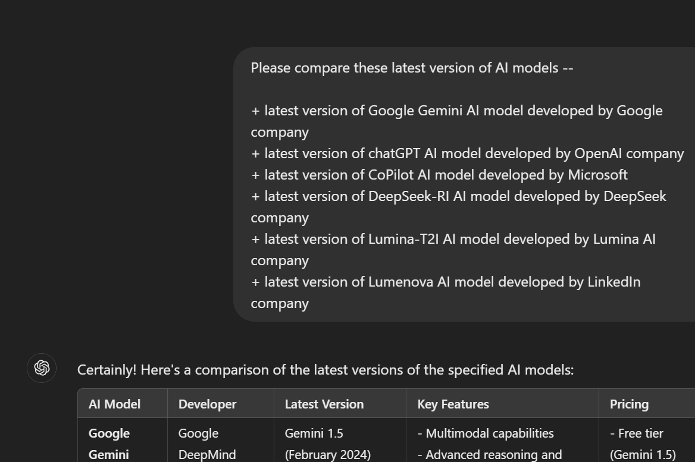

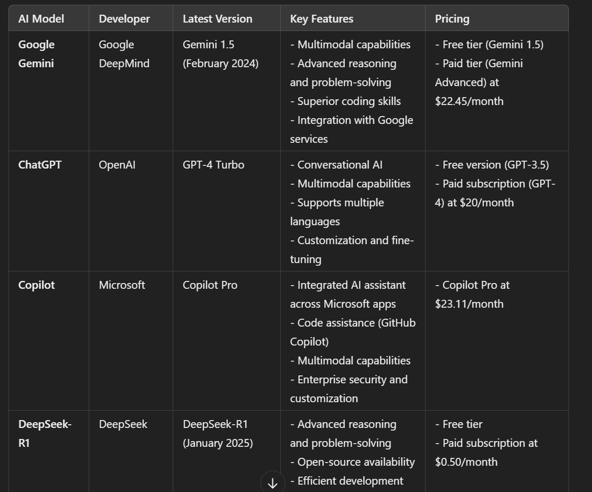

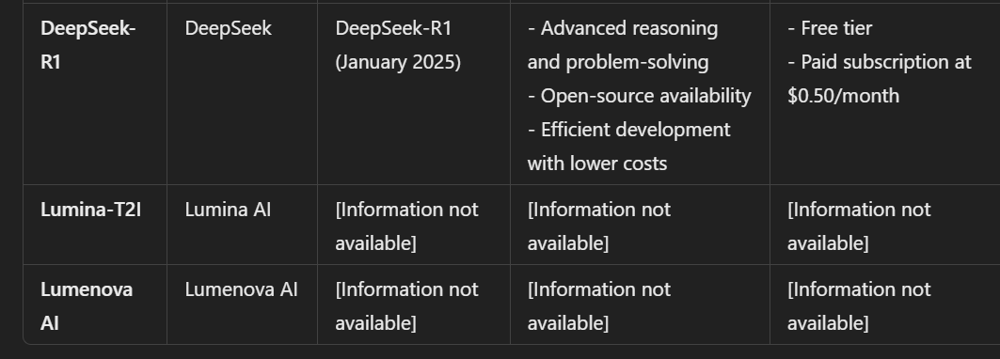

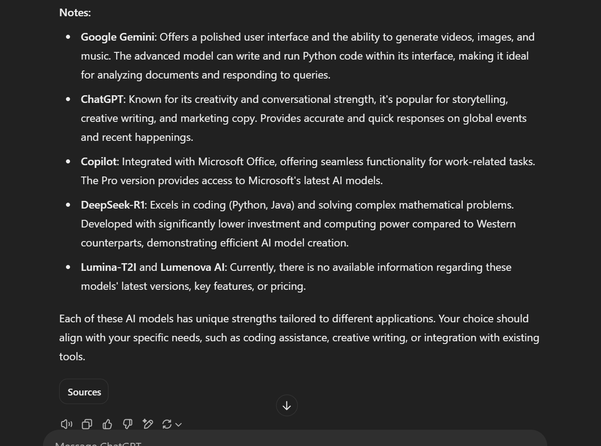