# deepseek
## Q1
Q1:

List top 10 of GDP in 2024.

A1:

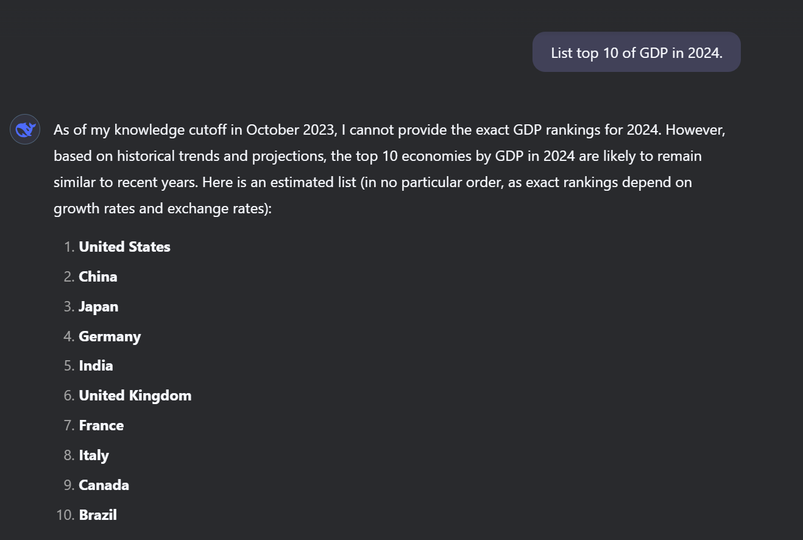

## Q2

Q2:

List top 10 of expected GDP in 2025.

A2:

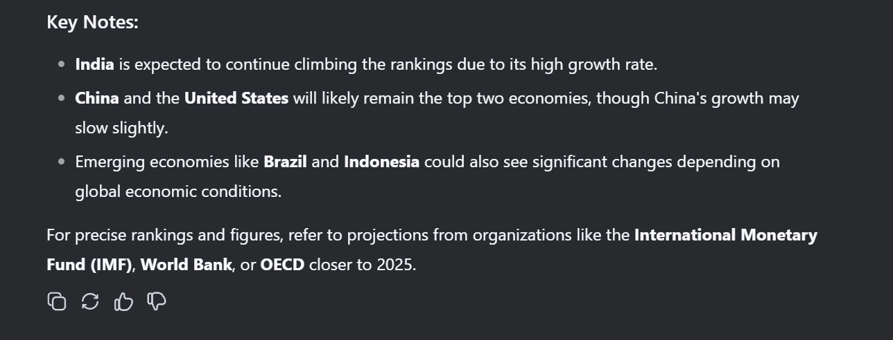

## Q3

Q3:

List top 10 of growth rate of GDP in 2024.

A3:

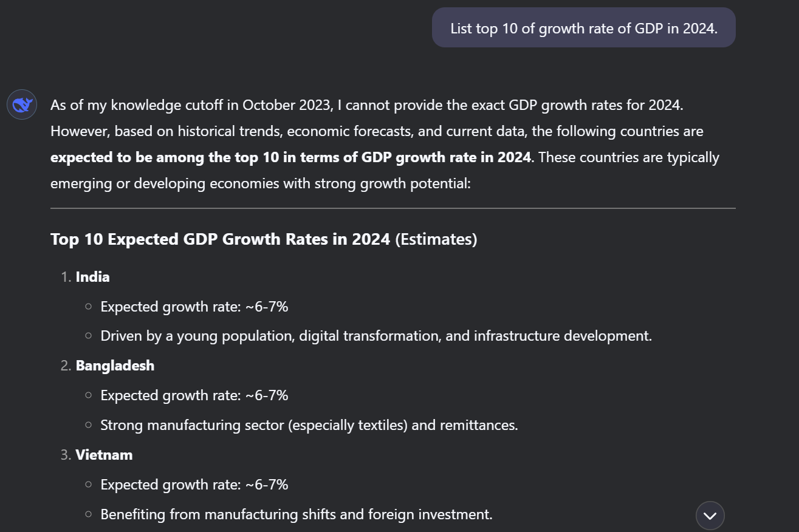

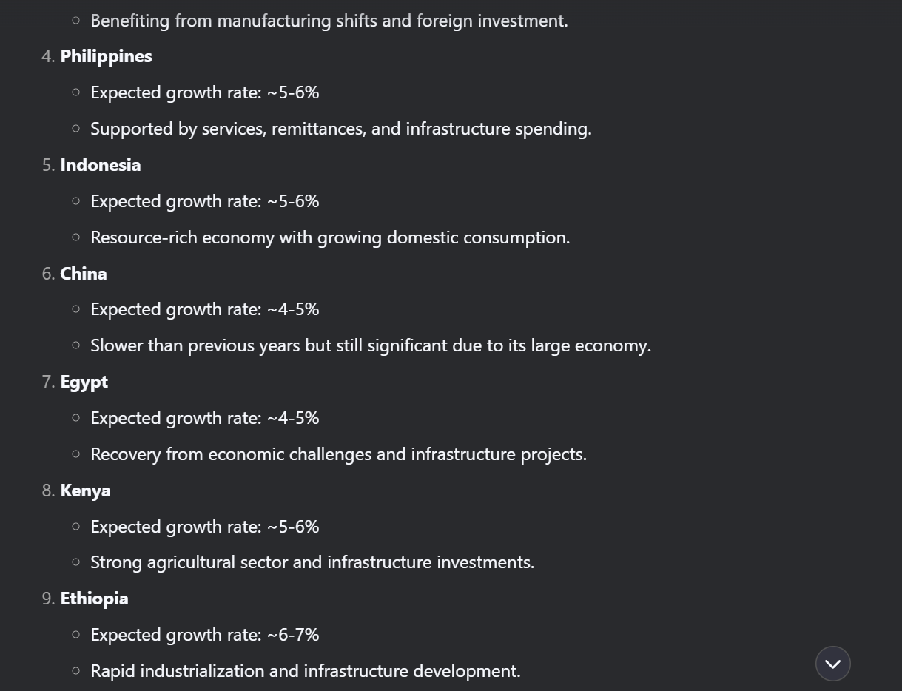

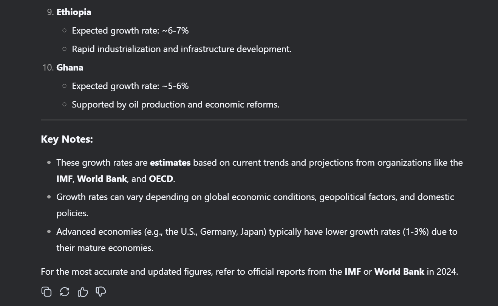

## Q4
Q4:

List top 10 of expected growth rate GDP in 2025.

A4:

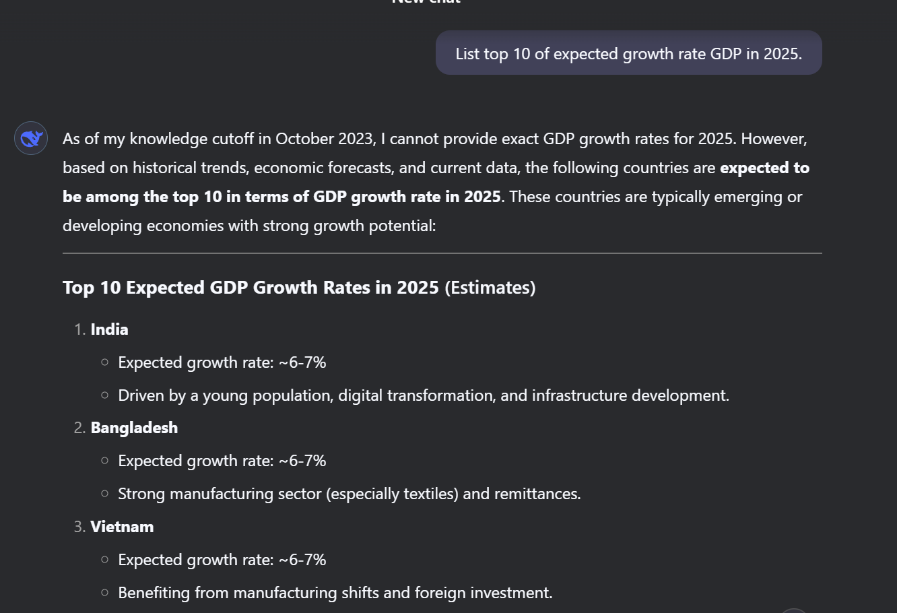

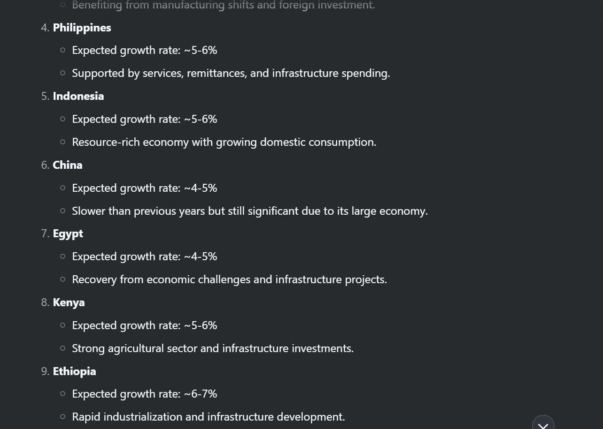

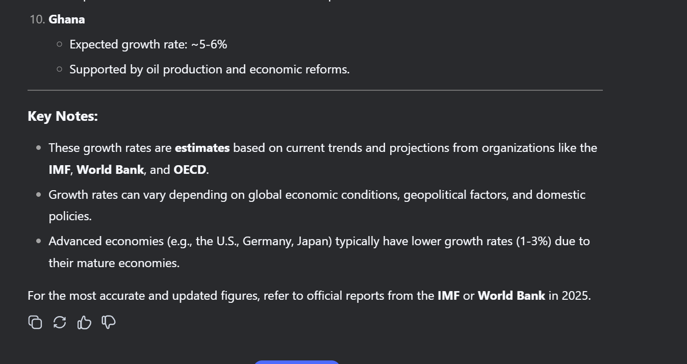

## Q5

Q5:

Do you expect that growth rate of GDP in America will be 5% in 2025? 

If the answer is yes, please tell me why?

If the answer is no, please tell me what percentage of growth rate of GDP in America will be 5% in 2025? and why?

A5:

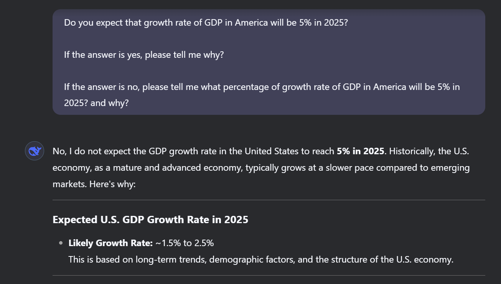

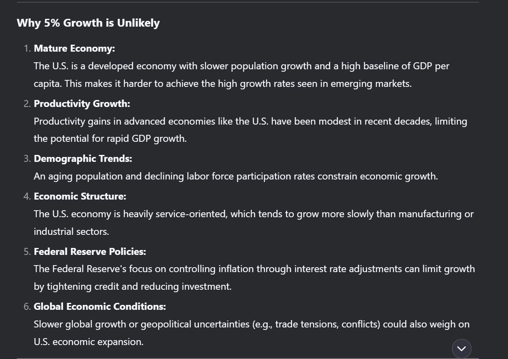

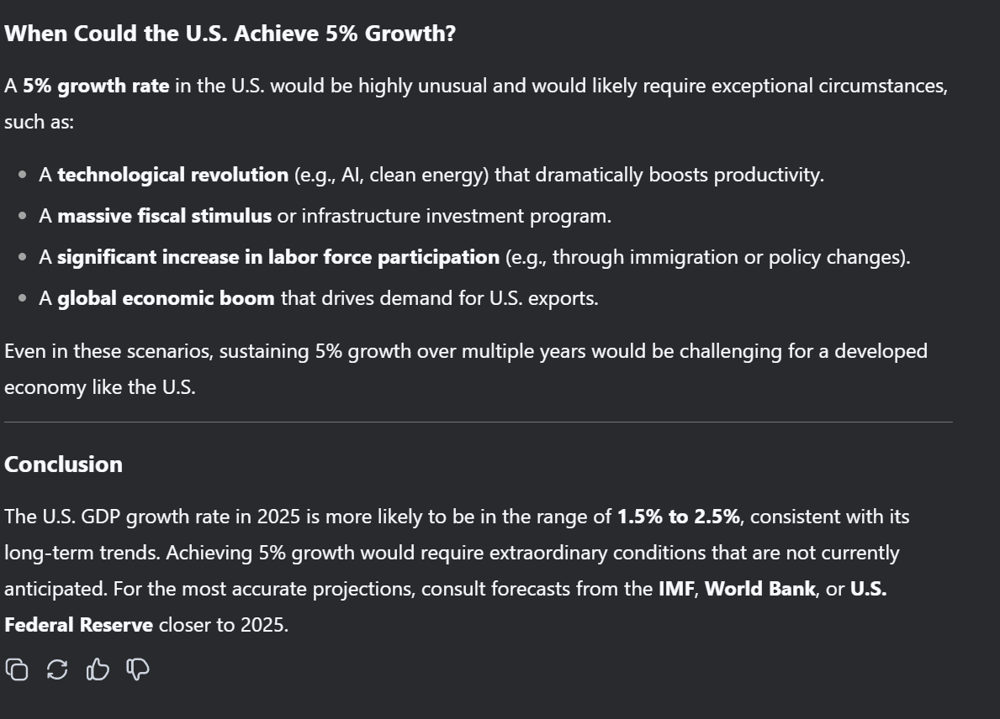

## Q6

Q6:

Do you expect that growth rate of GDP in China will be 5% in 2025? 

If the answer is yes, please tell me why?

If the answer is no, please tell me what percentage of growth rate of GDP in China will be 5% in 2025? and why?

A6:

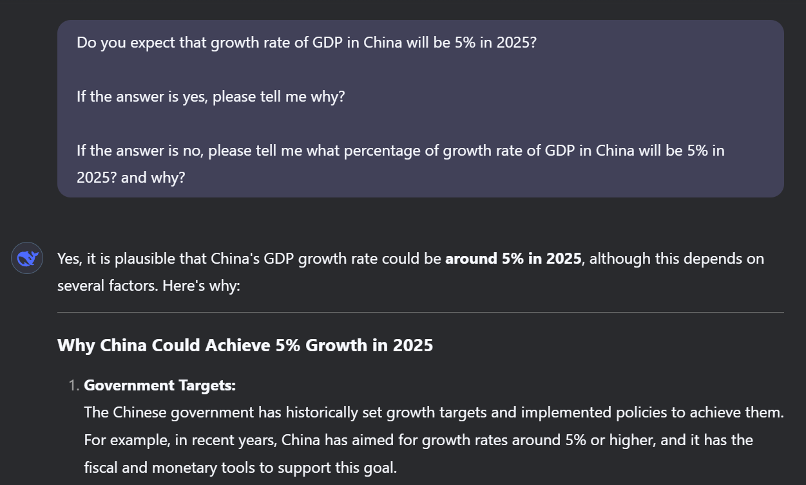

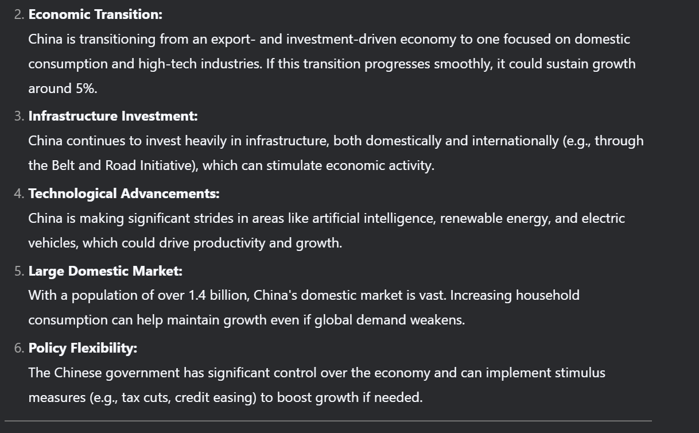

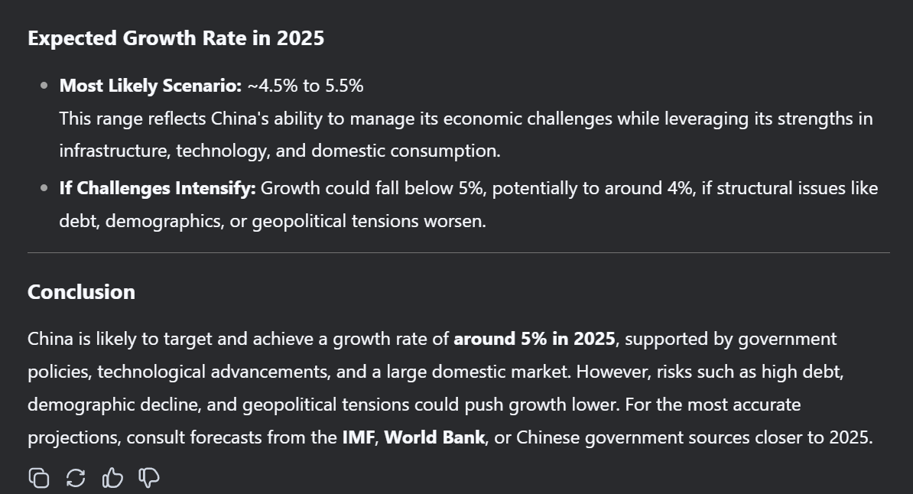
